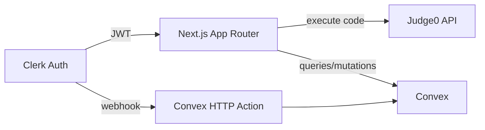

# CodeCraft Technical Documentation

## Overview
CodeCraft is a browser-based code editor that executes code remotely, stores snippets, and provides a lightweight developer profile. The system favors developer experience, fast iteration, and clear ownership boundaries between UI, execution, and storage.

## System Goals
- Zero local setup for code execution
- Fast time-to-first-run with predictable output
- Simple sharing with safe server-side persistence
- Auth-first design without custom auth infrastructure

## Tech Stack
- Frontend: Next.js 15, React 18, Tailwind CSS, Monaco Editor, Framer Motion
- Backend: Convex (queries, mutations, HTTP actions)
- Auth: Clerk
- Execution: Judge0 (public or self-hosted)
- Tooling: TypeScript, ESLint, PostCSS

## Architecture
```
Browser
  -> Next.js UI (Monaco, state, views)
  -> Judge0 (code execution)
  -> Convex (data + realtime queries)
  -> Clerk (auth + JWT)
```

## Runtime Flow


## Data Model
Users
- userId (Clerk subject)
- email
- name

CodeExecutions
- userId
- language
- code
- output (optional)
- error (optional)

Snippets
- userId
- title
- language
- code
- userName

SnippetComments
- snippetId
- userId
- userName
- content

Stars
- userId
- snippetId

Indexes
- users.by_user_id
- codeExecutions.by_user_id
- snippets.by_user_id
- snippetComments.by_snippet_id
- stars.by_user_id, by_snippet_id, by_user_id_and_snippet_id

## Core Components
- Editor UI: Monaco editor with per-language defaults and theme controls
- Execution Client: Judge0 API wrapper, handles stdout/stderr/compile_output
- Data Layer: Convex tables for users, snippets, comments, stars, and executions
- Auth: Clerk for sessions; Convex uses Clerk identity for access control

## Execution Flow
1) User selects language and runs code
2) Client maps language to Judge0 ID
3) `executeCode` sends submission to Judge0 with `wait=true`
4) Response is parsed; compile_output or stderr wins over stdout
5) Result is displayed and persisted as an execution record

## Snippet Workflow
1) User shares snippet
2) Convex mutation creates snippet record
3) Snippet detail page queries snippet + comments
4) Stars and comments are mutations with identity checks

## Authentication
- Clerk provides session and user identity
- Convex HTTP action handles Clerk webhook `user.created`
- On-demand user creation is used if webhook has not fired yet

## Error Handling
- Execution: compile_output/stderr surfaced directly to the output panel
- Snippet retrieval: missing snippet returns `null` to avoid client crash
- Auth: mutations reject unauthenticated requests

## Performance
- Monaco editor is rendered client-side only
- Editor/output panels use internal scroll to avoid layout shifts
- Convex subscription queries reduce redundant polling

## Security
- Clerk identity required for all write operations
- Webhook verification via Svix signatures
- Code execution isolated by Judge0 sandbox
- No secrets are exposed to the client beyond public endpoints

## Scalability
- Next.js frontend is stateless and CDN-friendly
- Convex scales via indexed queries and managed infra
- Judge0 can be self-hosted to remove public rate limits

## Limitations
- Public Judge0 endpoint is rate-limited and not production scale
- Remote execution adds network latency versus local runtimes
- Convex abstracts DB control, which limits advanced tuning

## Local Development
```bash
npm install
npx convex dev
npm run dev
```

## Environment Variables
```bash
NEXT_PUBLIC_CLERK_PUBLISHABLE_KEY=
CLERK_SECRET_KEY=
CONVEX_DEPLOYMENT=
NEXT_PUBLIC_CONVEX_URL=
NEXT_PUBLIC_JUDGE0_URL=https://ce.judge0.com
```

Convex dashboard:
```bash
CLERK_WEBHOOK_SECRET=
```

## Deployment
- Frontend: Vercel
- Convex: `npx convex deploy`
- Set env vars in both Vercel and Convex dashboards

## Future Enhancements
- stdin support and configurable execution limits
- Per-language version selector
- Abuse detection and execution throttling
- Team workspaces and private snippet collections
